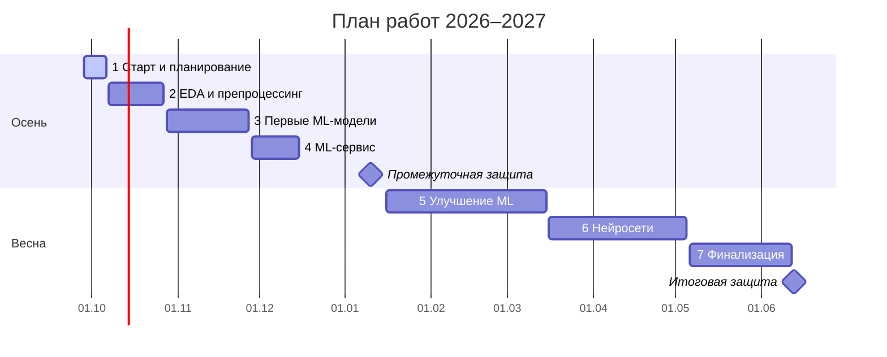

<div align="center">

# 🕵️ Детекция дипфейков на фото лиц

### Обобщение на незнакомые генераторы

Годовой проект №35 · Магистратура «Искусственный интеллект» · НИУ ВШЭ · 2026–2027


</div>

---

## 📌 О проекте

Детекторы дипфейков хорошо работают на академических датасетах, но заметно хуже – на изображениях генераторов, которых не было в обучении. В реальной жизни приходят именно такие.

**Цель:** построить сервис, который по фото лица определяет признаки дипфейка, и честно проверить его работу на фейках незнакомых генераторов.

**Исследовательский вопрос:** что лучше ловит фейки незнакомых генераторов – простая модель на предобученных признаках или дообученная нейросеть?

## 👥 Команда

| Участник | GitHub |
| --- | --- |
| Дмитрий Маслов | [@Dima-ML](https://github.com/Dima-ML) |
| Аяз Валиев | [@ayazvaliev](https://github.com/ayazvaliev) |
| Герта Лазовская | [@username](https://github.com/username) |
| Андрей Устамчук | [@username](https://github.com/username) |

**Куратор:** Илья Скворцов

## 🎯 Постановка задачи

| | |
| --- | --- |
| **Задача** | Бинарная детекция: real / fake |
| **Домен** | Фото лиц |
| **Фейк** | Изображение лица, полностью синтезированное или с заменой / редактированием лица |
| **Вход сервиса** | Фото (JPEG / PNG) |
| **Выход сервиса** | Одно из трёх состояний: «обнаружены признаки» / «не обнаружены» / «недостаточно данных» + версия модели и порог |

Почему три состояния: при малой доле подделок среди загрузок значительная часть тревог любого детектора ложная, поэтому сервис сообщает о признаках подделки, а не выносит вердикт. «Недостаточно данных» – если на фото нет лица, оно слишком маленькое или изображение сильно сжато.

## 🗂 Данные

Требования: публичный и популярный датасет, от ~3000 сэмплов на класс, сбалансированный, фото без тяжёлого препроцессинга.

| Датасет | Что внутри | Роль по умолчанию |
| --- | --- | --- |
| Deepfake and Real Images (OpenForensics) | ~190 тыс. кропов лиц 256×256 | Кандидат в основной |
| 140k Real and Fake Faces | FFHQ + StyleGAN | Тест обобщения |
| DF40, подмножество | 40 техник подделки с метками метода | Тест по типам атак |
| Четвёртый – по итогам поиска | Фото лиц в рамках требований | По итогам EDA |

На этапе EDA каждый участник разбирает свой датасет, основной и тестовые выбираем по результатам. Ссылки на датасеты появятся после чекпойнта 2.

## 📏 Метрики

| Метрика | Зачем |
| --- | --- |
| ⭐ **TPR при FPR = 1%** на незнакомых генераторах | Главная: сколько фейков ловим, обвиняя не больше 1% настоящих фото |
| ROC-AUC, AUC на худшем генераторе, EER | Качество ранжирования и худший случай |
| ΔAUC под деградациями | Устойчивость к цепочке «уменьшение → JPEG → пересохранение» |
| Brier, ECE | Калибровка: можно ли показывать уверенность модели |

## 🧪 Подход

```
FFT-признаки + логрегрессия   →   классический ML       →   эмбеддинги CLIP / ResNet   →   fine-tuning нейросетей
        (бейзлайн)                 (LBP, DCT, цвет, SRM)        + простой классификатор        (EfficientNet, ResNet, Xception)
```

**Принципы:**
- одна гипотеза за раз – каждый эксперимент меняет одну вещь;
- сравнение моделей при равных данных, сплитах, разрешении и бюджете;
- метрика фиксируется заранее, порог – на отдельном калибровочном наборе;
- контроль шорткатов: классификатор только по метаданным файлов должен давать AUC ≈ 0,5;
- метрики по каждому генератору отдельно плюс худший случай.

## 🗓 План работ

| № | Этап | Сроки | Результат |
| :-: | --- | --- | --- |
| 1 | Старт и планирование | до 6 октября | Тема, план, репозиторий, README |
| 2 | EDA и препроцессинг | 7–27 октября | EDA по датасетам, выбор основного и тестовых, сплиты, проверка утечек и шорткатов |
| 3 | Первые ML-модели | 28 октября – 27 ноября | Бейзлайн, классические модели на ручных признаках, таблица метрик |
| 4 | ML-сервис | 28 ноября – 15 декабря | FastAPI + Docker, три состояния, кроп лица, правило отказа, публичная ссылка |
| 🎤 | Промежуточная защита | 10–15 января | Результаты осени, демо сервиса, план на весну |
| 5 | Улучшение ML | январь – 15 марта | Эмбеддинги CLIP и CNN, тест на незнакомых генераторах, устойчивость, калибровка |
| 6 | Нейросети | 16 марта – 5 мая | Fine-tuning, сравнение ML и DL по обоим протоколам |
| 7 | Финализация | май – июнь | MLflow, воспроизводимость, анализ ошибок |
| 🏁 | Итоговая защита | 13–20 июня | Ответ на исследовательский вопрос, финальный сервис |



## 📁 Структура репозитория

```
├── data/        # описания и скрипты загрузки датасетов (сами данные не храним)
├── notebooks/   # EDA и эксперименты
├── src/         # признаки, модели, метрики
├── service/     # FastAPI-сервис и Dockerfile
├── reports/     # отчёты по чекпойнтам
└── README.md
```

## 🤝 Как работаем

- Разработка в отдельных ветках, изменения – через pull request.
- Эксперименты логируем в MLflow начиная с чекпойнта 3.
- Каждый созвон команды транскрибируем, договорённости – в чат.
